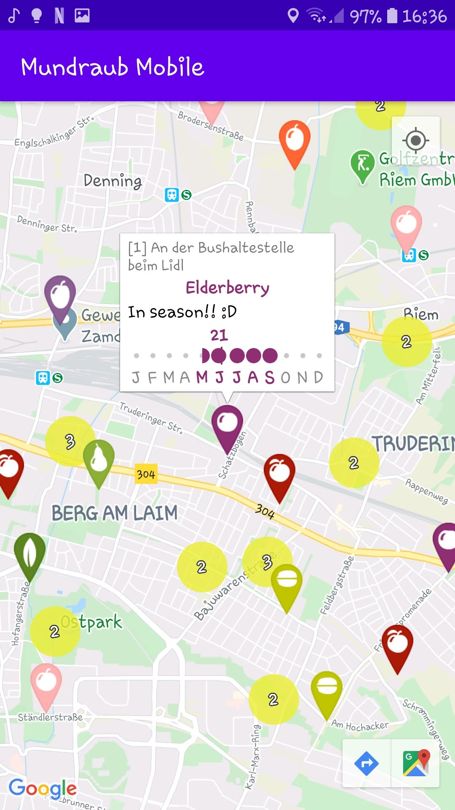

<table>
<tr>
<td>

</td>
<td rowspan="2"  valign="top">

#  Mundraub Mobile

Mundraub Mobile is an unofficial Kotlin Android app for using https://mundraub.org, a map of public fruit trees.

Go fruit foraging, discover your local neighborhood, reduce food waste, and gain a deeper appreciation for nature and her seasons!

Features:
- Look up local fruit trees and shrubs on Mundraub
    - including mini-calendar with seasonality information
- Google Maps integration for directions to markers
- Stays usable even when losing internet connection
- Languages: 🇺🇸/🇩🇪
- Not yet supported: User accounts (adding/editing markers)

</td>
</tr>
</table>

## How to build

Add your `google_maps_key` in a file called `app/src/debug/res/values/google_maps_api.xml` (and, for me, `app/src/release/res/values/google_maps_api.xml`)

    <resources>
        <string name="google_maps_key" templateMergeStrategy="preserve" translatable="false">yourKeyHere</string>
    </resources>

Then just build it in Android Studio.
